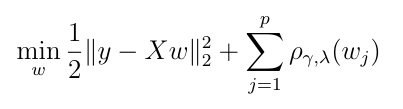
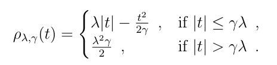

Benchmark repository for MCP
==============================

|Build Status| |Python 3.6+|

BenchOpt is a package to simplify and make more transparent and
reproducible the comparisons of optimization algorithms.
Regression with the Minimax Concave Penalty (MCP) consists in solving the following program:

with the penalty

where n (or n_samples) stands for the number of samples, p (or n_features) stands for the number of features and

.. math::

 y \in \mathbb{R}^n, X = [x_1^\top, \dots, x_n^\top]^\top \in \mathbb{R}^{n \times p}

Install
--------

This benchmark can be run using the following commands:

.. code-block::

   $ pip install -U benchopt
   $ git clone https://github.com/benchopt/benchmark_mcp
   $ benchopt run ./benchmark_mcp

Apart from the problem, options can be passed to `benchopt run`, to restrict the benchmarks to some solvers or datasets, e.g.:

.. code-block::

	$ benchopt run ./benchmark_mcp -s cd -d simulated --max-runs 10 --n-repetitions 5

Use `benchopt run -h` for more details about these options, or visit https://benchopt.github.io/cli.html.

.. |Build Status| image:: https://github.com/benchopt/benchmark_mcp/workflows/Tests/badge.svg
   :target: https://github.com/benchopt/benchmark_mcp/actions
.. |Python 3.6+| image:: https://img.shields.io/badge/python-3.6%2B-blue
   :target: https://www.python.org/downloads/release/python-360/
